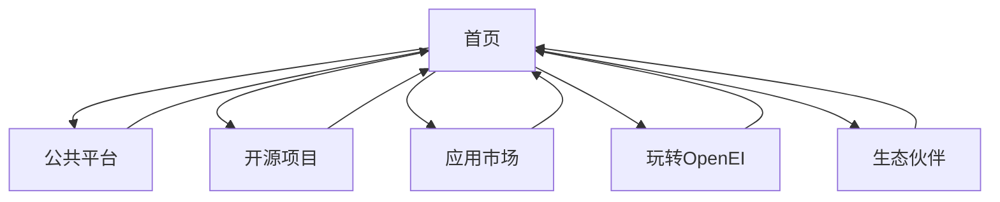

# OpenEI具身智能开源社区官网产品需求文档

## 1. Product Overview
OpenEI具身智能开源社区官网是一个展示具身智能技术、汇聚创新者和生态伙伴的综合性平台。网站旨在为具身智能创业者提供技术资源、经验分享和合作机会，推动具身智能技术的产业化应用。

目标是打造具身智能领域的核心开源社区，连接技术开发者、创业者和产业伙伴，降低具身智能创业门槛。

## 2. Core Features

### 2.1 User Roles
由于是展示型官网，暂不区分用户角色，所有访问者均可浏览全部内容。

### 2.2 Feature Module
基于网站内容分析，官网包含以下核心页面：
1. **首页**：品牌展示、核心理念介绍、导航入口
2. **公共平台页面**：平台功能和服务介绍
3. **开源项目页面**：开源项目展示和资源下载
4. **应用市场页面**：应用案例和解决方案展示
5. **玩转OpenEI页面**：使用指南和最佳实践
6. **生态伙伴页面**：合作伙伴展示和介绍

### 2.3 Page Details

| Page Name | Module Name | Feature description |
|-----------|-------------|---------------------|
| 首页 | Hero区域 | 展示OpenEI品牌标识、核心价值主张和主要功能入口 |
| 首页 | 核心理念展示 | 深挖需求、创意碰撞、仿真先行、智能具身四大核心理念介绍 |
| 首页 | 平台愿景 | 展示OpenEI社区的使命和愿景描述 |
| 首页 | 导航菜单 | 提供到各功能页面的快速导航链接 |
| 公共平台页面 | 平台介绍 | 详细介绍公共平台的功能特性和使用方法 |
| 开源项目页面 | 项目列表 | 展示开源项目清单、项目详情和下载链接 |
| 应用市场页面 | 应用展示 | 展示各行业应用案例和解决方案 |
| 玩转OpenEI页面 | 使用指南 | 提供平台使用教程和最佳实践案例 |
| 生态伙伴页面 | 伙伴展示 | 展示合作伙伴logo、公司信息和合作内容 |

## 3. Core Process
用户访问流程：
1. 用户访问首页，了解OpenEI平台概况和核心理念
2. 通过导航菜单进入感兴趣的功能页面
3. 在各功能页面浏览相关内容和资源
4. 通过生态伙伴页面了解合作机会

## 4. User Interface Design
### 4.1 Design Style
- 主色调：科技蓝色系（#1890ff）和深色背景
- 辅助色：白色文字、橙色强调色
- 按钮样式：现代化圆角按钮，支持悬停效果
- 字体：中文使用微软雅黑或苹方，英文使用Arial或Helvetica
- 布局风格：现代化卡片式布局，顶部导航栏设计
- 图标风格：简洁的线性图标和科技感图标

### 4.2 Page Design Overview

| Page Name | Module Name | UI Elements |
|-----------|-------------|-------------|
| 首页 | Hero区域 | 大背景图、居中标题、副标题、CTA按钮组 |
| 首页 | 核心理念 | 四列网格布局、图标+标题+描述的卡片设计 |
| 首页 | 平台愿景 | 文字内容区域，支持段落排版和重点突出 |
| 导航栏 | 主导航 | 水平导航菜单，支持悬停效果和当前页面高亮 |
| 生态伙伴页面 | 伙伴展示 | 网格布局的logo墙，支持悬停放大效果 |

### 4.3 Responsiveness
网站采用响应式设计，优先适配桌面端，同时兼容移动端访问。支持触摸交互优化，确保在各种设备上的良好用户体验。