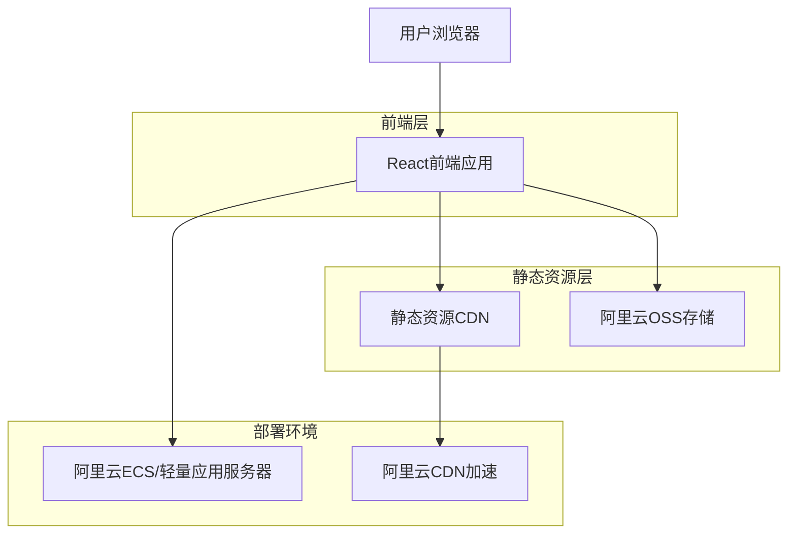
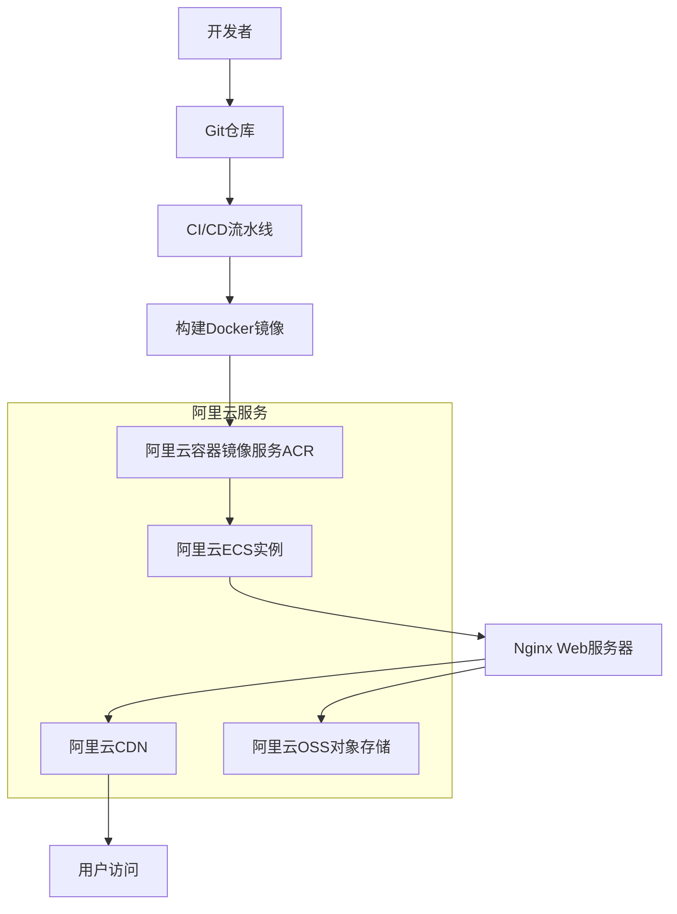

# OpenEI具身智能开源社区官网技术架构文档

## 1. Architecture design



## 2. Technology Description
- 前端：React@18 + TypeScript + Tailwind CSS + Vite
- 构建工具：Vite（快速构建和热更新）
- 样式框架：Tailwind CSS（原子化CSS框架）
- 部署：阿里云ECS + Nginx（静态文件服务）
- CDN：阿里云CDN（静态资源加速）

## 3. Route definitions

| Route | Purpose |
|-------|----------|
| / | 首页，展示OpenEI平台概况和核心理念 |
| /platform | 公共平台页面，介绍平台功能和服务 |
| /projects | 开源项目页面，展示项目列表和资源 |
| /marketplace | 应用市场页面，展示应用案例和解决方案 |
| /guide | 玩转OpenEI页面，提供使用指南和教程 |
| /partners | 生态伙伴页面，展示合作伙伴信息 |

## 4. 项目目录结构

```
openei-website/
├── public/                 # 静态资源目录
│   ├── images/            # 图片资源
│   ├── icons/             # 图标文件
│   └── favicon.ico        # 网站图标
├── src/                   # 源代码目录
│   ├── components/        # 可复用组件
│   │   ├── Header/        # 头部导航组件
│   │   ├── Footer/        # 底部组件
│   │   ├── Hero/          # 首页Hero区域组件
│   │   └── PartnerGrid/   # 合作伙伴网格组件
│   ├── pages/             # 页面组件
│   │   ├── Home/          # 首页
│   │   ├── Platform/      # 公共平台页面
│   │   ├── Projects/      # 开源项目页面
│   │   ├── Marketplace/   # 应用市场页面
│   │   ├── Guide/         # 使用指南页面
│   │   └── Partners/      # 生态伙伴页面
│   ├── styles/            # 样式文件
│   │   ├── globals.css    # 全局样式
│   │   └── components.css # 组件样式
│   ├── utils/             # 工具函数
│   ├── types/             # TypeScript类型定义
│   ├── App.tsx            # 主应用组件
│   ├── main.tsx           # 应用入口文件
│   └── router.tsx         # 路由配置
├── dist/                  # 构建输出目录
├── package.json           # 项目依赖配置
├── vite.config.ts         # Vite配置文件
├── tailwind.config.js     # Tailwind CSS配置
├── tsconfig.json          # TypeScript配置
└── README.md              # 项目说明文档
```

## 5. 部署方案

### 5.1 阿里云部署架构



### 5.2 部署步骤

1. **环境准备**
   - 购买阿里云ECS实例（推荐2核4G配置）
   - 配置安全组，开放80和443端口
   - 安装Docker和Docker Compose

2. **域名和SSL配置**
   - 购买域名并完成备案
   - 申请SSL证书（阿里云免费证书）
   - 配置DNS解析到ECS公网IP

3. **应用部署**
   - 构建React应用：`npm run build`
   - 将dist目录上传到服务器
   - 配置Nginx反向代理和静态文件服务
   - 启用Gzip压缩和缓存策略

4. **CDN加速配置**
   - 开通阿里云CDN服务
   - 配置源站为ECS实例
   - 设置缓存规则和HTTPS加速

### 5.3 Nginx配置示例

```nginx
server {
    listen 80;
    listen 443 ssl http2;
    server_name your-domain.com;
    
    # SSL配置
    ssl_certificate /path/to/certificate.crt;
    ssl_certificate_key /path/to/private.key;
    
    # 静态文件根目录
    root /var/www/openei-website/dist;
    index index.html;
    
    # Gzip压缩
    gzip on;
    gzip_types text/css application/javascript application/json;
    
    # 缓存策略
    location ~* \.(js|css|png|jpg|jpeg|gif|ico|svg)$ {
        expires 1y;
        add_header Cache-Control "public, immutable";
    }
    
    # SPA路由支持
    location / {
        try_files $uri $uri/ /index.html;
    }
}
```

## 6. 性能优化策略

1. **代码分割**：使用React.lazy()实现路由级别的代码分割
2. **图片优化**：使用WebP格式，实现懒加载
3. **资源压缩**：启用Gzip/Brotli压缩
4. **CDN加速**：静态资源通过阿里云CDN分发
5. **缓存策略**：合理设置浏览器缓存和CDN缓存时间

## 7. 监控和维护

1. **性能监控**：集成阿里云应用实时监控服务ARMS
2. **日志管理**：使用阿里云日志服务SLS收集访问日志
3. **安全防护**：开启阿里云Web应用防火墙WAF
4. **备份策略**：定期备份网站文件和配置到阿里云OSS